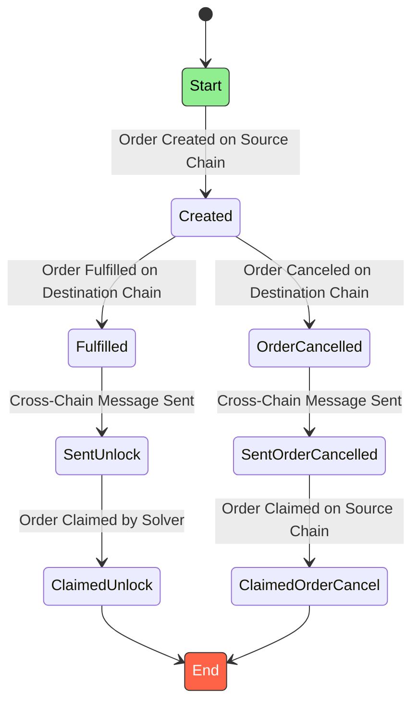

deBridge Liquidity Network uses a 0-TVL cross-chain trading infrastructure to facilitate high-performance cross-chain exchange. 
Instead of using liquidity pools, the DLN executes all trades asynchronously through a self-organized liquidity network, providing developers 
and projects with the ability to leverage the fastest cross-chain experience on the market and transfer liquidity and information with faster 
time to finality than any legacy cross-chain solution.

By shifting the cross-chain paradigm from bridging to networking, deBridge enables myriad unique features for applications and users:
- Near-instant settlement
- Limit orders for any cross-chain trade
- Zero slippage on any order size
- Unlimited market depth
- Guaranteed rates and low fees
- Native token trading (no custodial risks of wrapped assets)
- Zero locked liquidity at risk (0-TVL)
- Rapidly scalable (can process any trading volume)
- Gasless limit orders (users can commit orders without any upfront costs — tokens are deducted only if execution is guaranteed on the destination chain) (coming soon)
- Order + call data allows adding instructions to be executed together alongside order fulfillment